# System design

How a request moves through the GRC agent, from the user's click to the
feedback they see. GitHub renders the diagrams below.

## 1. Architecture

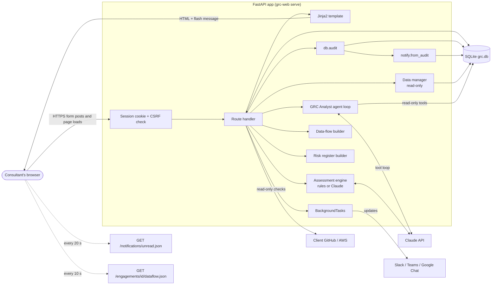

**The same six steps for every request:**

1. **Call:** the browser sends a GET (page) or POST (form) request.
2. **Gate:** the session cookie names the user. With no user, the request is redirected to `/login` (303). POSTs must also carry the CSRF token, otherwise 403.
3. **Work:** the route reads or writes SQLite over one connection. The connection commits when the request ends.
4. **Record:** state changes call `db.audit()`. That writes the audit log and, through `notify.from_audit()`, a notification.
5. **Side effects:** chat messages go out as `BackgroundTasks` after the response. Claude calls run in a thread pool.
6. **Feedback:** POSTs end with a **303 redirect** and a **flash message**, which is shown on the next page. GETs render HTML. Other users see a **toast** on their next 20-second poll.

## 2. Login

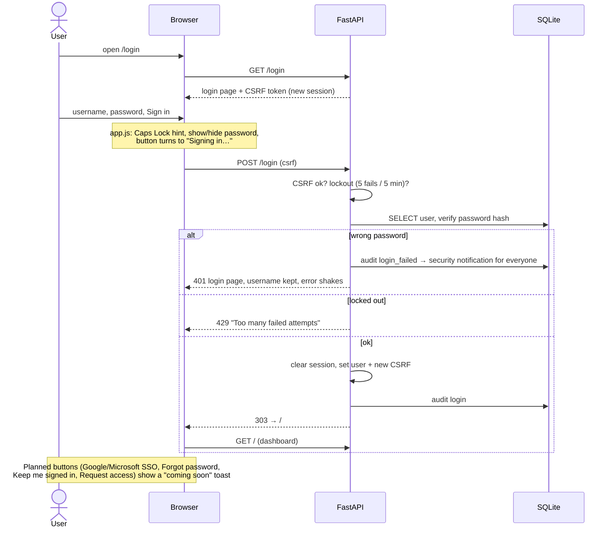

## 3. Dashboard load

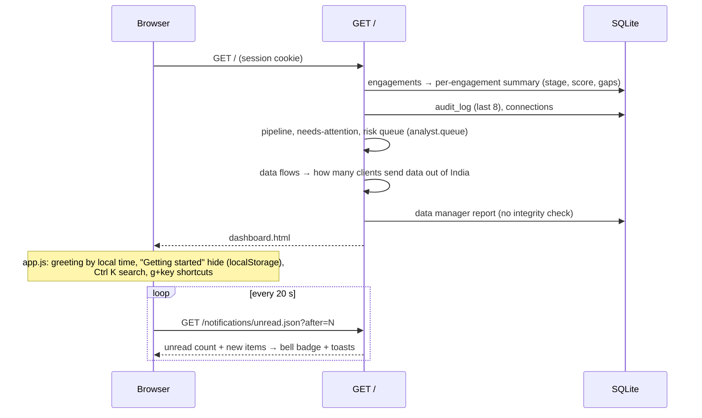

## 4. Engagement workflow: create, intake, assess, review, deliver

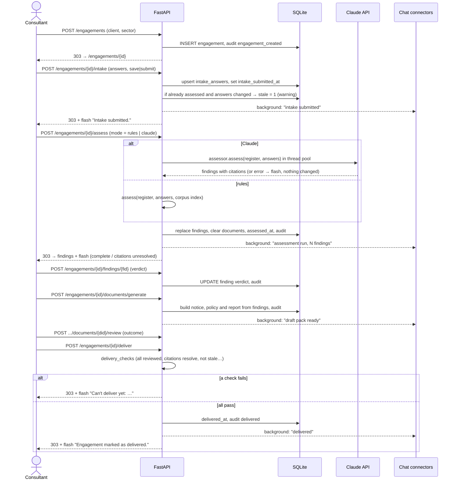

## 5. GRC Analyst question

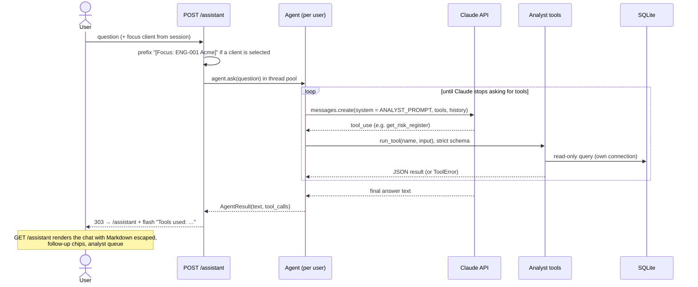

## 6. Evidence connectors

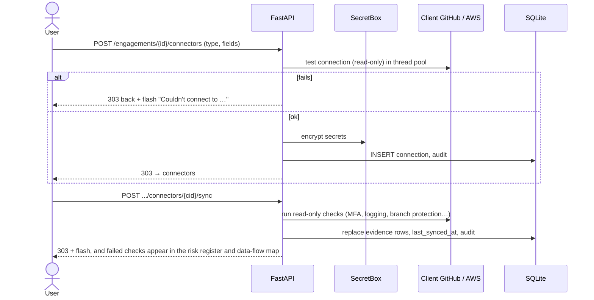

## 7. Notifications

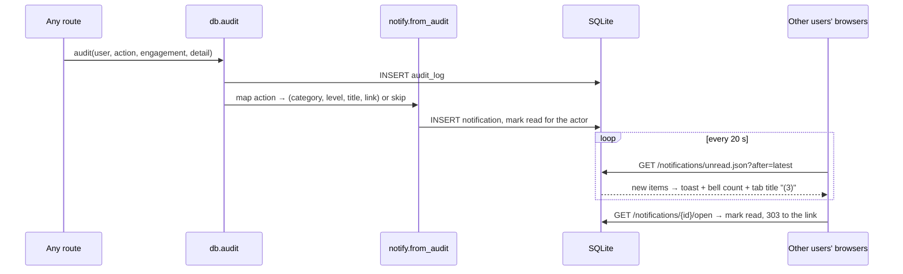

## 8. Live data-flow map

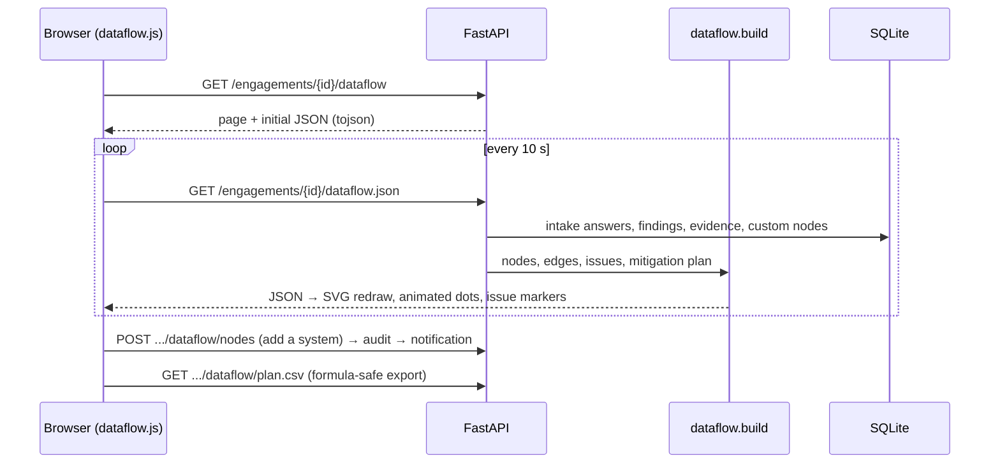

## 9. Risk register edit

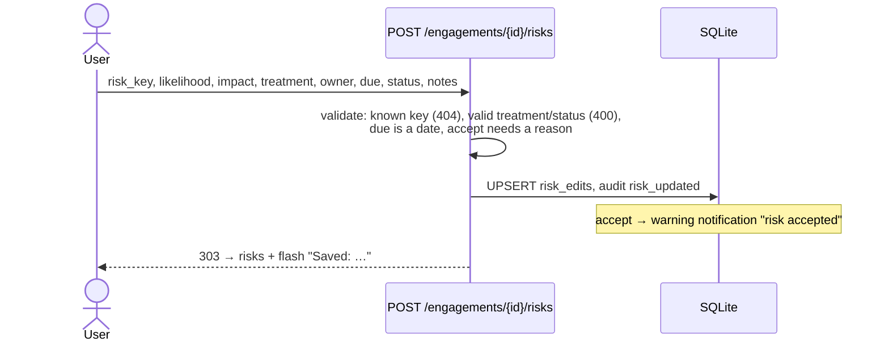

## 10. Data manager

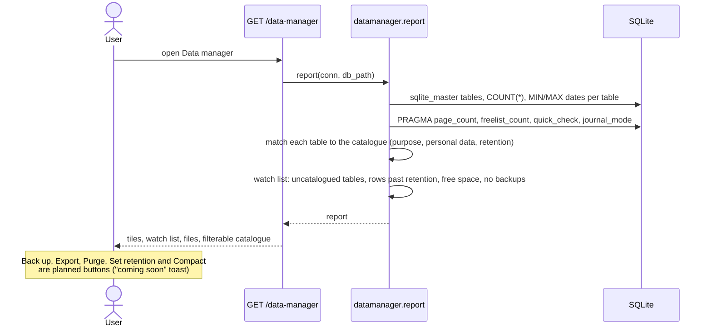

## 11. Planned buttons

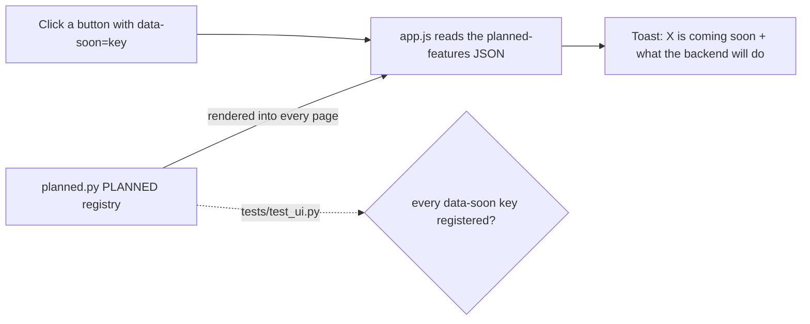

To build one: add the route, replace the `data-soon` button with a real form or link, delete the entry from `planned.py`, and add a test.
